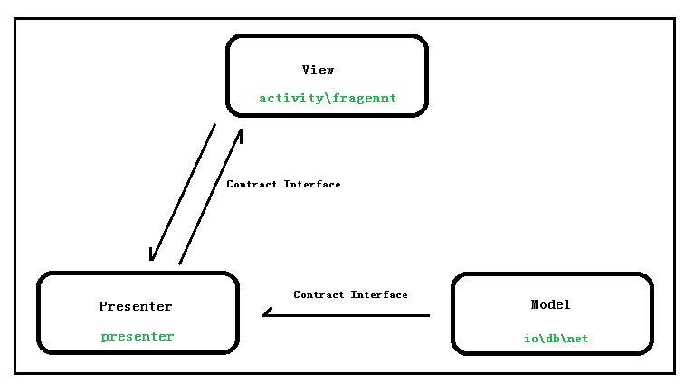
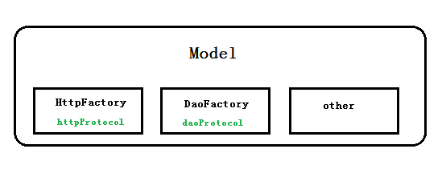
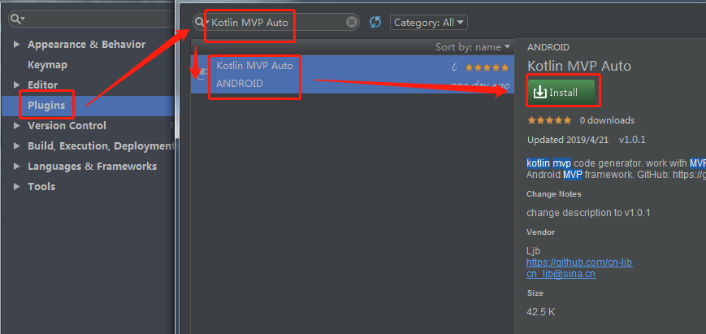

# MVPKotlin

> 快捷、高效、低耦合的Android MVP架构，支持Java、Kotlin混编。

<video  id="video" width="800" height="450" controls="" preload="none" poster="./img/插件演示.png" style="width=50%; height=50%; object-fit:fill">
	<source id="mp4" src="./img/插件演示.mp4">
</video>

## 视频演示

[[全部视频，点击这里]](https://cn-ljb.github.io/2019/07/08/Kotlin-MVP%E6%9E%B6%E6%9E%84%E8%A7%86%E9%A2%91%E6%BC%94%E7%A4%BA/ "视频演示")

扫码查看Demo：

* [目录](#)
	* [集成方式](#res1)
	* [概述](#res2)
	* [代码示例](#res3)
		* [Contract接口](#res3_1)
		* [View层](#res3_2)
		* [Presenter层](#res3_3)
		* [网络请求](#res3_4)
		* [数据库操作](#res3_5)
	* [Kotlin MVP Auto 插件](#res4)
	* [截图](#res5)

## 
集成方式

> * 1、Project的**build.gradle**文件添加如下代码：

	allprojects {
	    repositories {
	      	...
	        maven { url 'https://jitpack.io' }
	    }
	}

> * 2、主Module的**build.gradle**添加依赖：

    //mvp core
    implementation 'com.github.cn-ljb:kotlin-mvp-lib:1.2.0'
	
	//网络库lib、数据库lib 根据项目实际情况引入
    //net lib
    implementation 'com.github.cn-ljb:netlib:1.0.0'
    //dao lib
    implementation 'com.github.cn-ljb:daolib:1.0.0'

lib源码：[kotlin-mvp-lib](https://github.com/cn-ljb/kotlin-mvp-lib)、[net-lib](https://github.com/cn-ljb/netlib)、[dao-lib](https://github.com/cn-ljb/daolib)

## 
概述

> **为什么要使用MVP架构？**

通常Android项目结构中，我们会在Activity\Fragment中编写大量代码，例如：网络请求、IO操作、数据填充、页面切换等，这种项目结构宏观的称之为MVC。

**MVC**：我们可以把数据源（网络请求、IO...）看作Model层，xml等布局文件看作View层，Activity\Fragment看作Controller层。但在android中xml能力太薄弱了，以至于Activity做了很多本不属于它的工作。

**MVP**：在MVP架构中Model层与MVC一样存放数据源（网络请求、IO...），将Activity\Fragment都看作为View层，仅负责UI展示和数据填充，将Model层与View层的交互操作交给Presenter层。

> **MVP架构图**

> **特点**

 * 1、V层由Activity和Fragmen组成，且仅负责UI展示、数据填充等工作，分工明确；
 * 2、M层完全与V层隔离，P层作为V层与M层的桥梁，承担中间人角色（V通过P获取M数据）；
 * 3、V层与P层对象相互持有，通过Constract限制两者的访问域，降低耦合；
 * 4、P层持有M层对象，通过Constract限制P层可访问域，降低耦合；

> **扩展**

考虑到实际项目中Model层主要操作是net和db，为了统一调用api，对net和db进行了封装，通过Factory.getProtocol()产出具体的操作实例。

[net-lib](https://github.com/cn-ljb/netlib)： rxjava2 + rxAndroid + okhttp3 + retrofit2

[dao-lib](https://github.com/cn-ljb/daolib)： rxjava2 + rxAndroid + sqlite

## 
代码示例

[[祥见视频演示]](https://cn-ljb.github.io/2019/07/08/Kotlin-MVP%E6%9E%B6%E6%9E%84%E8%A7%86%E9%A2%91%E6%BC%94%E7%A4%BA/ "视频演示")
		
## 
Kotlin MVP Auto 插件

我们知道View、Presenter、Model、Constact需要编写固定的套路代码来进行关联，比如集成某一个Base类，实现某个固定接口。

为了提高开发效率，配合该MVP库专们为开发者提供[Kotlin MVP Auto插件](https://github.com/cn-ljb/kotlin-mvp-plugin "Kotlin MVP Auto")来帮你统统搞定。

### 安装插件

> 操作： File -> Settings -> Plugins -> Kotlin MVP Auto -> install

#### 插件演示

 * 自动生成View、Presenter、Model、Contract Kotlin文件

> 操作：包目录右键 -> New MVP Kotlin -> 输入模块名称 -> OK

<video  id="video" width="800" height="450" controls="" preload="none" poster="./img/插件演示.png" style="width=50%; height=50%; object-fit:fill">
	<source id="mp4" src="./img/插件演示.mp4">
</video>

 * 自动生成View、Presenter、Model、Contract Java文件

> 操作：包目录右键 -> New MVP Java -> 输入模块名称 -> OK

## 
截图：

